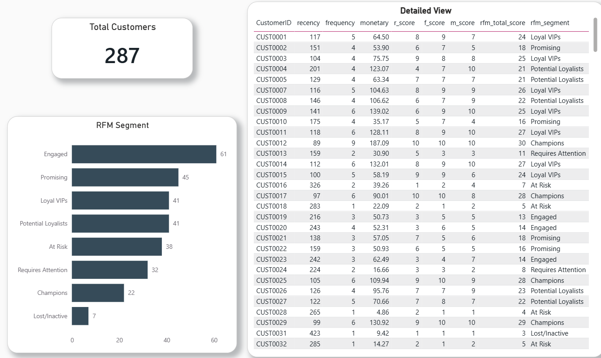

# SQL-Power-BI-RFM-Analysis
End-to-end data analysis project using SQL in Google Big Query for Customer Segmentation and Power BI for Interactive dashboarding

Project Overview
​This project implements a comprehensive RFM (Recency, Frequency, Monetary) Analysis to segment a customer base of 287 individuals. By leveraging SQL for data transformation and Power BI for visualization, the analysis identifies high-value customers, at-risk segments, and growth opportunities to drive data-driven marketing strategies.

🛠️ Tech Stack
* *Data Warehouse:* Google BigQuery
* *Language:* SQL (Data cleaning, decile scoring, and segmentation)
* *Visualization:* Power BI
* *Methodology:* RFM Segmentation (Quantile-based scoring)

​⚙️ The Workflow
​The project follows a 6-step end-to-end data pipeline:

​Data Ingestion: 
Monthly sales data loaded into Google BigQuery.
​RFM Calculation: 
SQL queries to compute:
​Recency: Days since the last purchase.
​Frequency: Total number of orders.
​Monetary: Total spend per customer.
​Decile Scoring: Assigned scores on a scale of 1–10 using quantiles (10 = Best, 1 =Worst).
​Composite Scoring: Summed R, F, and M scores to create a total score ranging from 3 to 30.
​Customer Segmentation: Mapped scores into behavioral segments such as Champions, Loyal VIPs, and At Risk.
​Dashboarding: Built an interactive Power BI report to visualize segment distributions and customer-level details.

📈 Key Insights & Segmentation
​Based on the analysis, the customer base is divided into several actionable categories
 Customer Segment Strategy
 | Segment | Strategy | Goal |
| :--- | :--- | :--- |
| *Champions* | Reward with exclusive perks and early access | Retain and leverage loyalty |
| *Loyal VIPs* | Offer loyalty programs and premium cross-selling | Maximize customer lifetime value |
| *Promising / Engaged* | Use personalized recommendations to boost frequency | Increase engagement and conversion |
| *At Risk / Needs Attention* | Send targeted win-back campaigns and limited-time offers | Prevent customer churn |
| *Lost / Inactive* | Evaluate re-engagement cost versus ROI before investing | Optimize marketing spend |

🚀 Interactive Dashboard Features

  

​Segment Breakdown: A bar chart displaying the volume of customers in each category (e.g., 61 Engaged customers).
​Detailed Drill-down: A granular table view showing individual CustomerID metrics, individual scores, and their assigned segment.
​Total Reach: KPI cards showing the total unique customer count (287).

